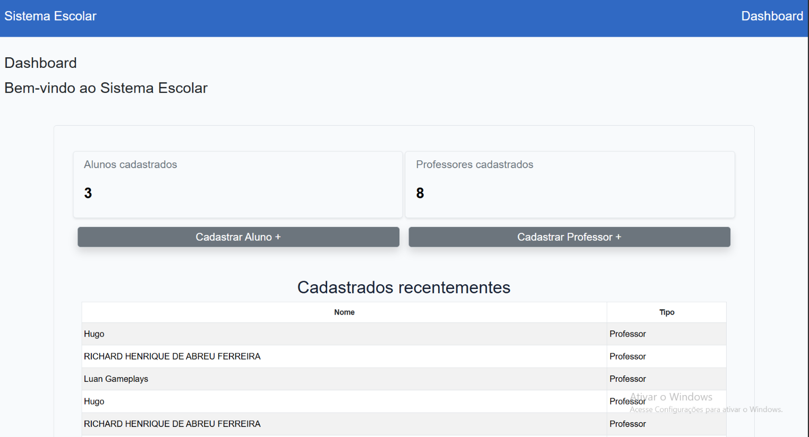
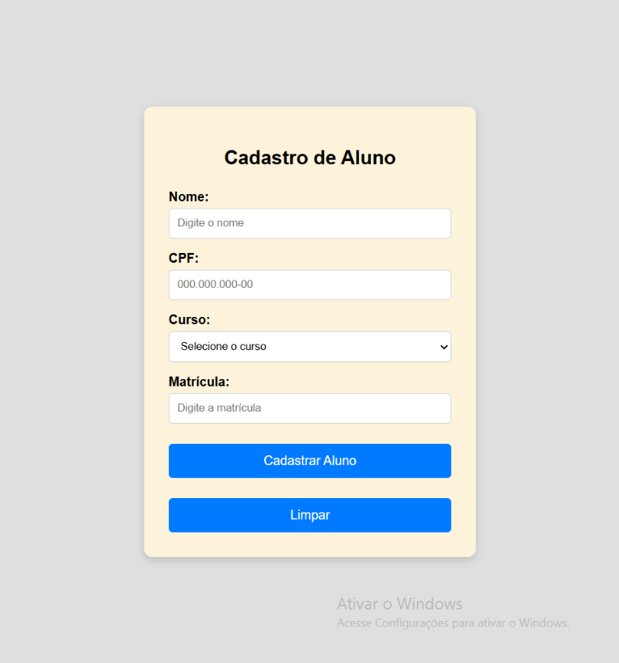
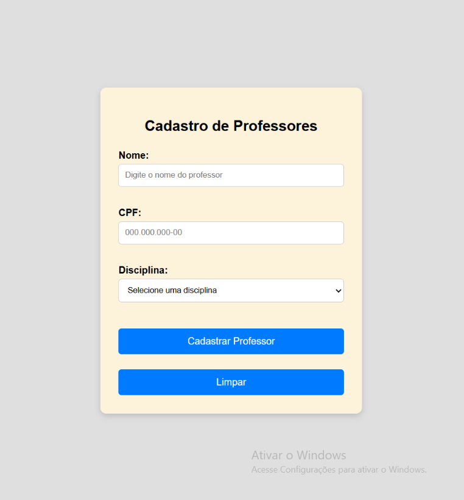

# Sistema de Cadastro Escolar

Sistema simples de cadastro escolar desenvolvido em **PHP** com dois objetivos:

1. **Testar os recursos do PHP disponíveis no servidor** (versão, sessões, redirecionamentos, carregamento de arquivos etc.).
2. **Praticar os princípios da Programação Orientada a Objetos (POO)** em PHP.

> Este projeto é um **teste**. Por isso ele não segue uma arquitetura definida (como MVC): o código está organizado apenas por pastas, de forma simples e direta.

---

## Funcionalidades

- **Cadastro de alunos**: nome, CPF, curso e matrícula.
- **Cadastro de professores**: nome, CPF e disciplina.
- **Dashboard**:
  - quantidade de alunos cadastrados;
  - quantidade de professores cadastrados;
  - lista dos **10 cadastros mais recentes** (nome e tipo).
- **Página inicial** (`index.php`) de apresentação do sistema.

É só isso, de propósito: o sistema não tem edição, exclusão, login nem banco de dados.

---

## Telas

| Dashboard | Cadastro de aluno | Cadastro de professor |
| :---: | :---: | :---: |
|  |  |  |

---

## Tecnologias

- **PHP** (requer **7.4 ou superior**, pois usa propriedades tipadas)
- **HTML5** e **CSS3**
- **Bootstrap 5.3.8** via CDN (usado apenas no dashboard)

---

## Estrutura de pastas

```
sistema_cadastro_escolar/
├── index.php                 # Página inicial de apresentação
├── session.php               # Inicia a sessão e concentra as funções de cadastro
│
├── public/                   # Arquivos estáticos públicos (imagens)
│   ├── dashboardPrint.png
│   ├── FormularioAluno.png
│   └── FormularioProfessor.png
│
└── src/                      # Código-fonte
    ├── classes/              # Todas as classes em um único lugar
    │   ├── Pessoa.php
    │   ├── Aluno.php
    │   ├── Professor.php
    │   └── CadastrosRecentes.php
    ├── pages/                # Páginas da aplicação
    │   ├── dashboard.php
    │   ├── cadastrarAluno.php
    │   └── cadastrarProfessor.php
    └── style/                # Arquivos CSS
        ├── reset.css
        ├── variable.css
        ├── style.css
        ├── dashboard.css
        ├── alunos.css
        └── professores.css
```

| Pasta / arquivo | Responsabilidade |
| --- | --- |
| `src/` | Guarda todo o código-fonte. |
| `src/classes/` | Guarda todas as classes em um único lugar. |
| `src/pages/` | Guarda as páginas (dashboard e formulários). |
| `src/style/` | Guarda todos os arquivos CSS. `style.css` importa `reset.css`, `variable.css` e `dashboard.css`. |
| `public/` | Guarda arquivos estáticos públicos, como as imagens. |
| `session.php` | Carrega as classes, inicia a sessão e expõe as funções `adicionarAluno()`, `adicionarProfessor()` e `recemCadastrados()`. |

---

## Conceitos de POO aplicados

| Conceito | Onde aparece | Como é usado |
| --- | --- | --- |
| **Classe abstrata** | `Pessoa` | Define o que todo cadastro tem em comum (`nome` e `CPF`) e não pode ser instanciada diretamente. |
| **Herança** | `Aluno` e `Professor` | Ambas estendem `Pessoa` e chamam `parent::__construct()` para reaproveitar o construtor. |
| **Encapsulamento** | Todas as classes | Atributos `protected` na classe base (`nome`, `CPF`) e `private` nas filhas (`Curso`, `Matricula`, `Disciplina`). O acesso é feito por métodos, como `getNome()` e `getCurso()`. |
| **Polimorfismo (por tipo)** | `CadastrosRecentes::adicionar(Pessoa $pessoa)` | O método aceita qualquer `Pessoa`, seja `Aluno` ou `Professor`. No dashboard, `instanceof` identifica o tipo para exibir na tabela. |
| **Singleton** | `CadastrosRecentes` | Construtor `private` e método estático `getInstance()`, garantindo uma única instância, guardada em `$_SESSION`. |
| **Métodos estáticos** | `CadastrosRecentes::getInstance()` | Permite obter a instância sem precisar de `new`. |
| **Tipagem** | Propriedades e retornos | Propriedades tipadas (`private string $Curso`) e tipos de retorno (`: string`, `: array`). |

### Diagrama de classes

```
        ┌──────────────────────┐
        │   Pessoa (abstract)  │
        │──────────────────────│
        │ # nome : string      │
        │ # CPF  : string      │
        │──────────────────────│
        │ + getNome() : string │
        └──────────▲───────────┘
                   │
         ┌─────────┴─────────┐
         │                   │
┌────────┴─────────┐ ┌───────┴──────────┐
│      Aluno       │ │    Professor     │
│──────────────────│ │──────────────────│
│ - Curso          │ │ - Disciplina     │
│ - Matricula      │ │                  │
│──────────────────│ │                  │
│ + getCurso()     │ │                  │
└──────────────────┘ └──────────────────┘

┌──────────────────────────────────────────┐
│       CadastrosRecentes (Singleton)      │
│──────────────────────────────────────────│
│ - historico : array<Pessoa>              │
│──────────────────────────────────────────│
│ - __construct()                          │
│ + static getInstance()                   │
│ + adicionar(Pessoa $pessoa)              │
│ + getHistorico() : array                 │
└──────────────────────────────────────────┘
```

---

## Recursos do PHP utilizados

Estes são os recursos que o sistema exercita, e que servem para validar o ambiente do servidor:

| Recurso | Onde |
| --- | --- |
| Sessões: `session_start()`, `session_status()` e `$_SESSION` | `session.php`, `CadastrosRecentes.php`, `dashboard.php` |
| Carregamento de arquivos: `require_once` e `__DIR__` | `session.php` e páginas |
| Tratamento de formulários: `$_SERVER["REQUEST_METHOD"]` e `$_POST` | `cadastrarAluno.php`, `cadastrarProfessor.php` |
| Redirecionamento: `header("Location: ...")` e `exit` | Páginas de cadastro, após o envio |
| Serialização de objetos na sessão | Objetos `Aluno`, `Professor` e `CadastrosRecentes` ficam guardados em `$_SESSION` |
| Funções de array: `array_unshift()`, `array_slice()` e `count()` | `CadastrosRecentes.php`, `dashboard.php` |
| Escape de saída: `htmlspecialchars()` | `dashboard.php`, ao exibir o nome |
| Verificação de tipo: `instanceof` | `dashboard.php` |
| Alternative syntax (`if: ... else: ... endif;` e `foreach: ... endforeach;`) | `dashboard.php` |

> **Detalhe importante:** em `session.php`, as classes são carregadas (`require_once`) **antes** de `session_start()`. Isso é necessário porque os objetos guardados na sessão são serializados, e o PHP precisa conhecer a classe para reconstruí-los ao ler a sessão novamente.

---

## Como funciona

```
index.php
   │
   ▼
dashboard.php ──► mostra contagens e os 10 cadastros mais recentes
   │
   ├──► cadastrarAluno.php      ─┐
   └──► cadastrarProfessor.php  ─┤  POST
                                 ▼
                    session.php (adicionarAluno / adicionarProfessor)
                                 │
                                 ├─► salva em $_SESSION["Alunos"] ou $_SESSION["Professores"]
                                 └─► CadastrosRecentes::getInstance()->adicionar($pessoa)
                                 │
                                 ▼
                    header("Location: dashboard.php")
```

1. O usuário abre o formulário de aluno ou de professor.
2. No envio (`POST`), a página chama `adicionarAluno()` ou `adicionarProfessor()`, de `session.php`.
3. A função cria o objeto (`new Aluno(...)` ou `new Professor(...)`), guarda-o no array correspondente da sessão e o registra no histórico, por meio do Singleton `CadastrosRecentes`.
4. O usuário é redirecionado para o dashboard, que lê os dados da sessão e atualiza a tela.

O histórico é limitado a **10 itens**: ao passar disso, `array_slice()` descarta os mais antigos.

---

## Como executar

### Requisitos

- PHP **7.4 ou superior**
- Suporte a **sessões** habilitado (é o padrão)
- Conexão com a internet (para carregar o Bootstrap via CDN no dashboard)

### Opção 1: servidor embutido do PHP

```bash
cd sistema_cadastro_escolar
php -S localhost:8000
```

Depois, acesse: <http://localhost:8000>

### Opção 2: Apache (XAMPP, WAMP, Laragon etc.)

1. Copie a pasta `sistema_cadastro_escolar` para o diretório público do servidor (por exemplo, `htdocs`).
2. Acesse: `http://localhost/sistema_cadastro_escolar/`

### Opção 3: servidor de hospedagem

1. Envie a pasta do projeto por FTP ou pelo gerenciador de arquivos da hospedagem.
2. Acesse o endereço correspondente no navegador.

---

## Checklist para validar o ambiente

Use este roteiro para confirmar que o servidor atende ao que o sistema precisa:

- [ ] A página inicial (`index.php`) carrega e exibe as imagens da pasta `public/`.
- [ ] O dashboard abre com os contadores zerados e a mensagem "Nenhum cadastro recente".
- [ ] Cadastrar um aluno redireciona para o dashboard e o contador de alunos sobe para 1.
- [ ] Cadastrar um professor redireciona para o dashboard e o contador de professores sobe para 1.
- [ ] Os dois nomes aparecem na tabela de recentes, com o tipo correto (Aluno / Professor), do mais novo para o mais antigo.
- [ ] Ao cadastrar mais de 10 pessoas, a tabela continua mostrando apenas 10.
- [ ] Os dados continuam disponíveis ao navegar entre as páginas (a sessão está funcionando).

Se algum item falhar, verifique a versão do PHP, se as sessões estão habilitadas e se o diretório de sessões do servidor tem permissão de escrita.

---

## Limitações conhecidas

Como o objetivo é apenas testar, o sistema tem limitações propositais:

- **Sem banco de dados:** os dados ficam apenas na **sessão** do usuário. Eles se perdem quando a sessão expira ou o navegador é fechado, e cada visitante enxerga apenas os próprios cadastros.
- **Sem validação no servidor:** os campos só têm validação básica do HTML (`required`, `maxlength`). CPF, matrícula e duplicidade não são verificados no PHP.
- **Sem autenticação:** qualquer pessoa com acesso à URL pode usar o sistema.
- **Funcionalidades mínimas:** não há edição, exclusão nem listagem completa. Existe apenas o cadastro e o dashboard.
- **Dados armazenados, mas não exibidos:** CPF, matrícula e disciplina são guardados nos objetos, mas ainda não possuem *getters* nem aparecem em nenhuma tela.
- **Sem testes automatizados.**
